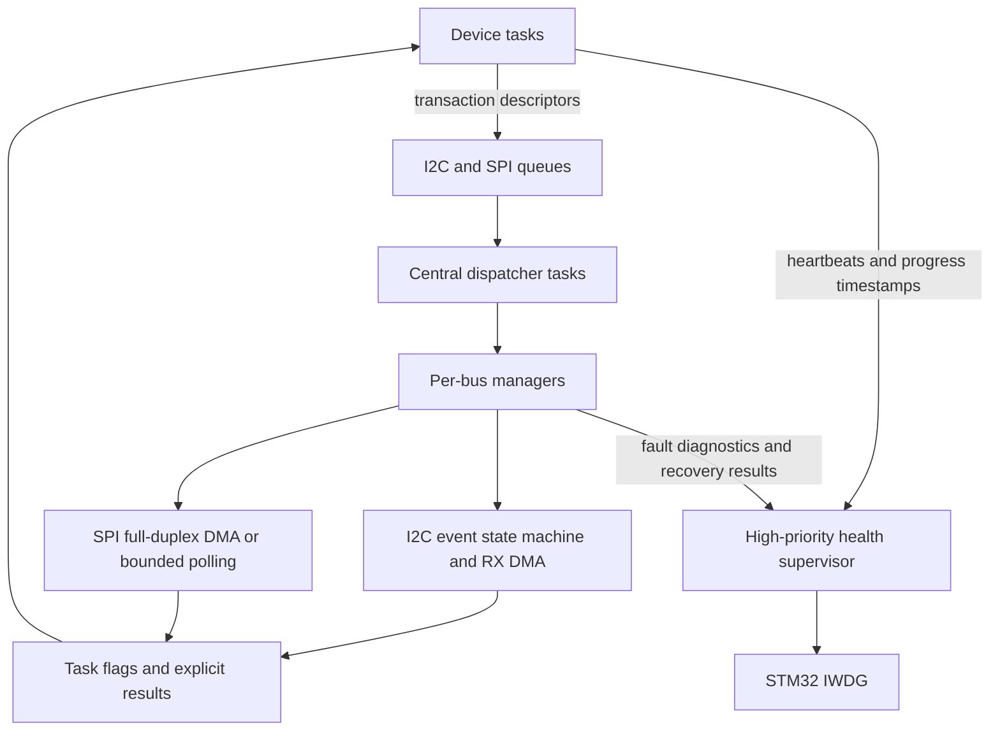

# Fault-Tolerant STM32F4 Multi-Device Sensor Hub

An STM32F407 firmware project that coordinates multiple I2C and SPI devices
under FreeRTOS using STM32 LL drivers, interrupt-driven state machines, DMA,
centralized bus arbitration, runtime diagnostics, bus recovery, and an
independent hardware watchdog.

The project focuses on concurrency, failure handling, and observability rather
than simply supporting a large number of sensors.

## Hardware

- STM32F407G-DISC1 (STM32F407VGT6)
- BME280 environmental sensor on I2C1
- MPU6050/MPU6500 inertial sensor on I2C1 with a data-ready interrupt
- RC522 RFID reader on SPI1
- nRF24L01 receiver on SPI1
- nRF24L01 transmitter on SPI3
- Two ILI9341 displays on SPI2

All external modules use 3.3 V logic and share a common ground. The complete
connection table is available in [PIN_MAP.md](PIN_MAP.md).

## Architecture



Device tasks never start periodic I2C DMA transfers directly. They submit
immutable job descriptors to a central dispatcher. The dispatcher serializes
access to each bus, detects DMA stream conflicts, and reports completion or a
specific error back to the requesting task.

## Main engineering features

### Interrupt-driven I2C with DMA

Periodic BME280 and MPU6050 reads use an STM32F4 I2C event state machine. The
event interrupt advances through START, address, register address, repeated
START, read address, and data phases. DMA moves the payload into memory, while
sensor conversion and compensation remain in task context.

The manager reports NACK, timeout, bus error, arbitration loss, overrun, DMA
error, and abort conditions separately. Failed transfers are never processed
as fresh sensor data.

### Centralized SPI ownership

SPI1, SPI2, and SPI3 have independent mutex-protected manager contexts. Long
payloads and display updates use DMA. Short, bounded register transactions,
such as RC522 accesses, use polling because DMA setup would cost more than the
transfer itself.

For full-duplex DMA, RX is enabled before TX. Chip select remains asserted
until both streams complete and the SPI BSY flag clears.

### Deliberate blocking policy

The project does not attempt to make every operation non-blocking:

- one-time initialization and short register operations use bounded polling;
- periodic sensor reads and long payloads use interrupts and DMA;
- every wait has a timeout or an RTOS blocking primitive;
- no sensor processing is performed inside an ISR.

### I2C stuck-bus recovery

If I2C1 remains BUSY, the manager first resets the peripheral. If SDA is still
held low, GPIO-based recovery generates up to nine SCL pulses followed by an
explicit STOP condition, restores the pins to AF4 open-drain mode, and retries
the operation once.

Jobs are not requeued forever when physical recovery fails. The error is
returned to the device task, and the health supervisor eventually stops feeding
the watchdog if valid data does not resume.

### Health monitoring and watchdog

A high-priority supervisor evaluates both task liveness and useful work:

- BME280 and MPU6050: age of the last valid measurement;
- RC522: periodic Version register verification;
- nRF24L01 TX: age of the last successful TX_DS event;
- nRF24L01 RX: age of the last completed payload;
- ILI9341: age of the last successful display DMA operation;
- all application tasks: heartbeat presence in the monitor window.

The independent watchdog starts immediately. A bounded startup grace period
allows the peripherals to initialize. After the system becomes operational,
the watchdog is fed only while all required heartbeats and progress checks are
healthy. The nominal watchdog timeout is approximately five seconds; the exact
value depends on the internal LSI oscillator tolerance.

The watchdog is frozen while the core is halted by a debugger, so breakpoints
remain usable.

### FreeRTOS safety hooks

- stack-overflow checking with `configCHECK_FOR_STACK_OVERFLOW = 2`;
- malloc-failed hook;
- `configASSERT` routed to the fault recorder;
- runtime stack high-water marks;
- current and minimum-ever free heap measurements;
- fatal fault task name and handle capture.

## Runtime diagnostics

Add the following single expression to STM32CubeIDE Live Expressions:

```c
g_runtime_debug
```

It contains I2C line levels and registers, manager recovery counters, queue
depth, sensor data ages, SPI progress ages, watchdog state, initialization
state, reset cause, and stale-subsystem information.

`stale_subsystem_mask` uses the following bits:

| Bit value | Monitored subsystem |
|---:|---|
| 1 | BME280 |
| 2 | MPU6050/MPU6500 |
| 4 | RC522 |
| 8 | nRF24L01 TX |
| 16 | nRF24L01 RX |
| 32 | ILI9341 display pipeline |

## Build

1. Open STM32CubeIDE 1.19 or a compatible version.
2. Import this directory as an existing STM32CubeIDE project.
3. Open `LL_multi_device.ioc` if pin or RTOS regeneration is required.
4. Build the Debug configuration.
5. Flash using the on-board ST-LINK interface.

The last locally verified Debug build used GNU Tools for STM32 13.3 and
completed without compiler warnings:

```text
text: 80,420 bytes
data:    100 bytes
bss:  59,076 bytes
```

Build artifacts are intentionally excluded from version control.

## Validation performed

The integrated firmware has been exercised with all listed devices connected.
Bench fault injection included temporary I2C disconnection, SDA bus lock,
watchdog recovery, repeated watchdog resets, and nRF24L01 disconnection and
reconnection. The firmware recovered from transient faults and reset when
required progress did not resume.

The repeatable validation plan and evidence fields are documented in
[HARDWARE_VALIDATION.md](HARDWARE_VALIDATION.md).

## Known limitations

- The project is an engineering and learning platform, not certified
  production firmware.
- ILI9341 write transfers do not provide an acknowledgement. DMA progress can
  detect a stalled software pipeline, but it cannot prove that a physically
  disconnected panel received the pixels without an additional readback path.
- nRF24L01 RX freshness assumes this demo's paired transmitter sends a packet
  approximately once per second. A general-purpose receiver must make this
  policy configurable because silence can be valid behavior.
- Recovery currently escalates to a full MCU watchdog reset. A production
  design may attempt per-device reinitialization before resetting the system.
- Jumper wires and breadboards are not representative of production hardware.
  Proper decoupling, pull-ups, grounding, and PCB layout remain necessary.
- Diagnostic counters are stored in normal RAM and are cleared by reset. Only
  the RCC reset-cause flags survive for the next boot.

## Project status

The current implementation is feature-complete for its learning objective.
Future work should prioritize repeatable measurements, long-duration stress
testing, documentation, and a clean-room rewrite rather than adding more
sensors.
