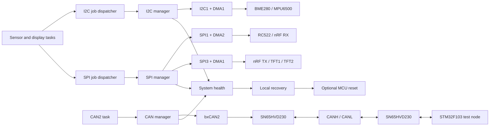

# Fault-Tolerant STM32F4 Multi-Device Hub

Register/LL-level STM32F407 firmware that operates I2C, SPI and Classic CAN devices concurrently under FreeRTOS. The project is a learning and validation platform for non-blocking peripheral drivers, interrupt-driven execution, DMA, fault diagnosis and bus recovery.

The current full configuration contains:

| Interface | Devices / node | Execution model |
|---|---|---|
| I2C1 | BME280, MPU6500 | Event/error IRQ state machine; RX data phase uses DMA |
| SPI1 | RC522, nRF24L01 RX | Interrupt/DMA transfers with device-specific chip select |
| SPI3 | nRF24L01 TX, ILI9341 TFT1, ILI9341 TFT2 | Shared bus, separate CS pins, interrupt/DMA transfers |
| CAN2 | STM32F103 node through two SN65HVD230 transceivers | Register-level bxCAN, TX/RX/error interrupts |

The STM32F103 test node is kept intentionally simple and uses HAL. The STM32F407 side is the system under study.

## Design goals

- Keep sensor tasks independent from peripheral register access.
- Serialize devices sharing one physical bus while allowing different peripherals to operate concurrently.
- Avoid polling loops in normal runtime data transfers.
- Record which source, operation, address or CAN ID last succeeded or failed.
- Attempt local peripheral/bus recovery before considering a whole-MCU reset.
- Keep reset permission explicit through `is_mcu_reset_allowed`.
- Expose useful state through STM32CubeIDE Live Expressions.

## Architecture



## Peripheral ownership and concurrency

Each shared peripheral has one software owner:

- Sensor tasks submit jobs and wait for completion flags; they do not manipulate I2C/SPI registers directly.
- I2C and SPI dispatchers serialize jobs belonging to the same peripheral.
- I2C1, SPI1, SPI3 and CAN2 can progress independently, so a slow serial bus does not force the CPU or unrelated buses to wait.
- Interrupt handlers perform only the time-critical hardware work and notify the corresponding task.

## I2C manager

The I2C1 manager uses an interrupt-driven state machine for START, address, register-address and repeated-START phases. Periodic sensor reads use DMA for the data-register-to-memory portion. The current implementation does **not** claim I2C TX DMA support.

It handles:

- START, ADDR, TXE, RXNE and BTF sequencing
- 1-byte, 2-byte and multi-byte receive endings
- ACK/NACK, POS and LAST behavior
- AF/NACK, bus error, arbitration loss and overrun reporting
- transfer timeout and abort
- physical bus recovery by temporarily controlling SCL/SDA when necessary
- startup and runtime peripheral reinitialization

## SPI manager

SPI1 and SPI3 use independent contexts and DMA streams. Multiple devices share clock/data pins but have their own chip-select pins.

The manager provides:

- full-duplex clocked transfers
- interrupt/DMA completion and error reporting
- per-device CS control
- timeout/abort handling
- peripheral recovery
- post-recovery device validation before a recovery is counted as successful

SPI3 is intentionally shared by nRF24L01 TX and both ILI9341 displays. Serialization prevents their CS windows from overlapping.

## CAN manager

STM32F4 bxCAN has no ST LL driver in this firmware package, so CAN2 is controlled directly through its registers.

Current configuration:

- Classic CAN at 500 kbit/s
- standard and extended data/remote frame representation
- three hardware TX mailboxes
- RX FIFO0 and FIFO1 interrupt handling
- software RX ring with peek/release ownership
- TX, RX0, RX1 and SCE interrupts
- automatic retransmission and automatic bus-off management
- CAN2 filter bank 14 configured as accept-all for the present test
- ACK/progress timeout detection (3 seconds)
- peripheral reinitialization and recovery diagnostics

There is no DMA path because bxCAN already owns its TX mailboxes, RX FIFOs, arbitration and frame serialization in hardware.

## System health and recovery

`system_health.c` tracks every configured bus with these states:

- `SYSTEM_BUS_STATE_OK`
- `SYSTEM_BUS_STATE_SUSPECT`
- `SYSTEM_BUS_STATE_RECOVERING`
- `SYSTEM_BUS_STATE_FAILED`

For each bus, diagnostics include:

- last successful tick and current data age
- last successful source and operation
- last address, register or CAN ID
- last failure and fault age
- recovery attempt/success/failure counts
- consecutive failures
- reset deadline and whether reset was suppressed

Recovery success means more than “the reset function returned”: the corresponding sensor/node must produce valid communication again. A whole-MCU reset is permitted only when `is_mcu_reset_allowed` is true.

## Useful Live Expressions

- `bme280_display_data`
- `mpu6050_display_data`
- `nrf24l01_display_data`
- `rc522_display_data`
- `ili9341_dma_success_count`
- `ili9341_dma_error_count`
- `g_can2_debug`
- `g_can2_last_tx_frame`
- `g_can2_last_rx_frame`
- `g_system_bus_health`
- `is_mcu_reset_allowed`

## Hardware and wiring

See [PIN_MAP.md](PIN_MAP.md) before connecting modules. Important points:

- All modules and both CAN nodes need a common ground.
- CANH/CANL require 120-ohm termination at the two physical ends of the bus.
- PB12/PB13 are CAN2 RX/TX; the displays therefore use SPI3, not SPI2.
- SPI3 is shared; each device must use only its own CS pin.
- Verify the voltage requirements of every breakout board before powering it.

## Build

The current workspace builds with:

- STM32CubeIDE 2.2.0
- GNU Arm Embedded Toolchain 14.3
- STM32Cube FW_F4 V1.28.3
- FreeRTOS through CMSIS-RTOS v2

Latest local Debug build after the full-device re-enable:

```text
text   89136
data     100
bss    60500
total 149736 bytes
0 errors, 0 warnings
```

## Validation status

The complete configuration has been exercised on assembled hardware for 15 minutes with all enabled devices operating concurrently. During this run, the BME280, MPU6500, RC522, both nRF24L01 paths, both ILI9341 displays and the STM32F407/STM32F103 CAN link operated as expected without an observed communication failure.

This is a successful integration/smoke test, not a long-duration endurance or product-qualification test. Multi-hour operation and extended repeated fault injection remain to be documented.

Use [HARDWARE_VALIDATION.md](HARDWARE_VALIDATION.md) for the staged validation procedure. Do not treat a successful build as proof of electrical or long-duration stability.

## Current limitations

- I2C TX DMA is not implemented.
- CAN filtering is currently accept-all rather than application-specific.
- A 15-minute full-load integration test has passed; multi-hour endurance results are not yet recorded.
- Extended repeated multi-bus fault-injection results are not yet recorded.
- The project is a development/learning platform, not a certified safety product.

## Repository guide

- `Core/Src/i2c_manager.c`, `Core/Inc/i2c_manager.h`: I2C state machine, DMA receive and recovery
- `Core/Src/spi_manager.c`, `Core/Inc/spi_manager.h`: SPI DMA manager and recovery
- `Core/Src/can_manager.c`, `Core/Inc/can_manager.h`: register-level bxCAN manager
- `Core/Src/system_health.c`, `Core/Inc/system_health.h`: health state and recovery bookkeeping
- `Core/Src/main.c`: generated initialization, RTOS task wiring and application integration
- `PIN_MAP.md`: authoritative connection map for this revision
- `HARDWARE_VALIDATION.md`: hardware test checklist
