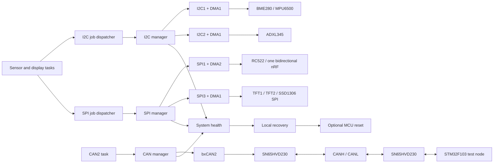

# Fault-Tolerant STM32F4 Multi-Device Hub / Hataya Dayanıklı STM32F4 Çoklu Cihaz Merkezi

Register/LL-level STM32F407 firmware that operates I2C, SPI and Classic CAN devices concurrently under FreeRTOS. The project is a learning and validation platform for non-blocking peripheral drivers, interrupt-driven execution, DMA, fault diagnosis and bus recovery.

FreeRTOS altında I2C, SPI ve Classic CAN cihazlarını eş zamanlı çalıştıran, register/LL seviyesinde geliştirilmiş STM32F407 firmware projesidir. Proje; non-blocking çevre birimi sürücüleri, interrupt tabanlı çalışma, DMA, hata teşhisi ve veri yolu kurtarma konularını öğrenmek ve doğrulamak için oluşturulmuş bir platformdur.

The current full configuration contains:

Mevcut tam yapılandırma aşağıdaki bileşenleri içerir:

| Interface | Devices / node | Execution model |
|---|---|---|
| I2C1 | BME280, MPU6500 | Event/error IRQ state machine; RX data phase uses DMA |
| I2C2 | ADXL345 | Periodic RX DMA for acceleration data |
| SPI1 | RC522, one bidirectional nRF24L01 | Shared bus; a single radio-owner task serializes NRF RX/TX mode changes |
| SPI3 | ILI9341 TFT1, ILI9341 TFT2, SSD1306 SPI | Shared bus, separate CS pins, interrupt/DMA transfers |
| CAN2 | STM32F103 node through two SN65HVD230 transceivers | Register-level bxCAN, TX/RX/error interrupts |

| Arabirim | Cihazlar / düğüm | Çalışma modeli |
|---|---|---|
| I2C1 | BME280, MPU6500 | Event/error IRQ durum makinesi; RX veri aşamasında DMA |
| I2C2 | ADXL345 | İvme verileri için periyodik RX DMA |
| SPI1 | RC522, çift yönlü çalışan bir nRF24L01 | Paylaşımlı veri yolu; tek bir radyo-sahibi task, NRF RX/TX mod değişimlerini sıraya koyar |
| SPI3 | ILI9341 TFT1, ILI9341 TFT2, SSD1306 SPI | Paylaşımlı veri yolu, ayrı CS pinleri, interrupt/DMA transferleri |
| CAN2 | İki SN65HVD230 transceiver üzerinden STM32F103 düğümü | Register seviyesinde bxCAN, TX/RX/hata interrupt'ları |

The STM32F103 test node is kept intentionally simple and uses HAL. The STM32F407 side is the system under study.

STM32F103 test düğümü özellikle basit tutulmuş ve HAL kullanılmıştır. Üzerinde çalışılan asıl sistem STM32F407 tarafıdır.

## Demonstration video / Tanıtım videosu

[Watch the approximately 5-minute hardware demonstration on YouTube](https://www.youtube.com/watch?v=anP3AZDGQVM)

[Yaklaşık 5 dakikalık donanım videosunu YouTube'da izleyin](https://www.youtube.com/watch?v=anP3AZDGQVM)

The video shows the complete STM32F407/STM32F103 configuration running under
FreeRTOS, live sensor/display updates and recovery after selected sensor,
nRF24L01 and CAN connections are interrupted and restored. Sensor register
initialization is performed with polling transfers; normal runtime sensor data
acquisition uses interrupt-driven state machines and DMA. MPU6500 sampling is
started from its data-ready interrupt.

Video; eksiksiz STM32F407/STM32F103 yapılandırmasının FreeRTOS altında çalışmasını, canlı sensör/ekran güncellemelerini ve seçilen sensör, nRF24L01 ve CAN bağlantıları kesilip yeniden kurulduktan sonraki recovery davranışını gösterir. Sensör register başlangıç ayarları polling transferleriyle yapılırken normal çalışma sırasındaki sensör verileri interrupt tabanlı durum makineleri ve DMA ile alınır. MPU6500 örneklemesi data-ready interrupt'ı ile başlatılır.

## Design goals / Tasarım hedefleri

- Keep sensor tasks independent from peripheral register access.
- Sensör task'larını çevre birimi register erişiminden bağımsız tutmak.
- Serialize devices sharing one physical bus while allowing different peripherals to operate concurrently.
- Aynı fiziksel veri yolunu paylaşan cihazları sıraya koyarken farklı çevre birimlerinin eş zamanlı çalışmasına izin vermek.
- Avoid polling loops in normal runtime data transfers.
- Normal çalışma sırasındaki veri transferlerinde polling döngülerinden kaçınmak.
- Record which source, operation, address or CAN ID last succeeded or failed.
- En son başarılı veya başarısız olan kaynak, işlem, adres ya da CAN ID bilgisini kaydetmek.
- Attempt local peripheral/bus recovery before considering a whole-MCU reset.
- Tüm MCU'yu resetlemeyi düşünmeden önce yerel çevre birimi/veri yolu recovery işlemini denemek.
- Keep reset permission explicit through `is_mcu_reset_allowed`.
- Reset iznini `is_mcu_reset_allowed` üzerinden açık ve denetlenebilir tutmak.
- Expose useful state through STM32CubeIDE Live Expressions.
- Yararlı sistem durumlarını STM32CubeIDE Live Expressions üzerinden gözlemlenebilir hâle getirmek.

## Architecture / Mimari



## Peripheral ownership and concurrency / Çevre birimi sahipliği ve eş zamanlı çalışma

Each shared peripheral has one software owner:

Paylaşılan her çevre biriminin tek bir yazılımsal sahibi vardır:

- Sensor tasks submit jobs and wait for completion flags; they do not manipulate I2C/SPI registers directly.
- Sensör task'ları işleri kuyruğa gönderir ve tamamlanma flag'lerini bekler; I2C/SPI register'larına doğrudan müdahale etmez.
- I2C and SPI dispatchers serialize jobs belonging to the same peripheral.
- I2C ve SPI dispatcher'ları aynı çevre birimine ait işleri sıraya koyar.
- I2C1, I2C2, SPI1, SPI3 and CAN2 can progress independently, so a slow serial bus does not force the CPU or unrelated buses to wait.
- I2C1, I2C2, SPI1, SPI3 ve CAN2 birbirinden bağımsız ilerleyebilir; böylece yavaş bir seri veri yolu CPU'yu veya ilgisiz veri yollarını beklemeye zorlamaz.
- Interrupt handlers perform only the time-critical hardware work and notify the corresponding task.
- Interrupt handler'ları yalnızca zaman açısından kritik donanım işlemlerini yapar ve ilgili task'a bildirim gönderir.
- The NRF TX task produces requests, while the NRF RX/radio-owner task alone changes CE, CSN and radio mode on the single SPI1 NRF24L01.
- NRF TX task'ı istekleri üretirken tek SPI1 NRF24L01 üzerindeki CE, CSN ve radyo modu değişikliklerini yalnızca NRF RX/radyo-sahibi task gerçekleştirir.

## I2C manager / I2C yöneticisi

The multi-bus I2C manager uses an interrupt-driven state machine for START, address, register-address and repeated-START phases. Periodic sensor reads use RX DMA on both I2C1 and I2C2.

Çoklu veri yolu destekleyen I2C manager; START, cihaz adresi, register adresi ve repeated-START aşamalarında interrupt tabanlı bir durum makinesi kullanır. Periyodik sensör okumalarında hem I2C1 hem de I2C2 üzerinde RX DMA kullanılır.

It handles:

Şu işlemleri yönetir:

- START, ADDR, TXE, RXNE and BTF sequencing
- START, ADDR, TXE, RXNE ve BTF sıralaması
- 1-byte, 2-byte and multi-byte receive endings
- 1 byte, 2 byte ve çok baytlı alımların sonlandırılması
- ACK/NACK, POS and LAST behavior
- ACK/NACK, POS ve LAST davranışları
- AF/NACK, bus error, arbitration loss and overrun reporting
- AF/NACK, bus error, arbitration loss ve overrun raporlaması
- transfer timeout and abort
- Transfer timeout ve iptal işlemleri
- physical bus recovery by temporarily controlling SCL/SDA when necessary
- Gerektiğinde SCL/SDA hatlarını geçici olarak kontrol ederek fiziksel veri yolu recovery işlemi
- startup and runtime peripheral reinitialization
- Başlangıçta ve çalışma sırasında çevre biriminin yeniden başlatılması

## SPI manager / SPI yöneticisi

SPI1 and SPI3 use independent contexts and DMA streams. Multiple devices share clock/data pins but have their own chip-select pins.

SPI1 ve SPI3 birbirinden bağımsız context'ler ve DMA stream'leri kullanır. Birden fazla cihaz clock/veri pinlerini paylaşırken her cihazın kendine ait chip-select pini bulunur.

The manager provides:

Manager şu özellikleri sağlar:

- full-duplex clocked transfers
- Full-duplex clock'lu transferler
- interrupt/DMA completion and error reporting
- Interrupt/DMA tamamlanma ve hata raporlaması
- per-device CS control
- Cihaz bazında CS kontrolü
- timeout/abort handling
- Timeout/iptal yönetimi
- peripheral recovery
- Çevre birimi recovery işlemi
- post-recovery device validation before a recovery is counted as successful
- Recovery başarılı sayılmadan önce cihazın yeniden doğrulanması

SPI3 is shared by both ILI9341 displays and the SPI SSD1306. SPI1 is shared by RC522 and the single bidirectional NRF24L01. Serialization prevents CS windows from overlapping.

SPI3, iki ILI9341 ekran ve SPI SSD1306 tarafından paylaşılır. SPI1 ise RC522 ve çift yönlü çalışan tek NRF24L01 tarafından paylaşılır. İşlemlerin sıraya konulması, CS aktiflik aralıklarının çakışmasını önler.

## CAN manager / CAN yöneticisi

STM32F4 bxCAN has no ST LL driver in this firmware package, so CAN2 is controlled directly through its registers.

Bu firmware paketinde STM32F4 bxCAN için ST LL sürücüsü bulunmadığından CAN2 doğrudan register'ları üzerinden kontrol edilir.

Current configuration:

Mevcut yapılandırma:

- Classic CAN at 500 kbit/s
- 500 kbit/s hızında Classic CAN
- standard and extended data/remote frame representation
- Standard ve extended data/remote frame gösterimi
- three hardware TX mailboxes
- Üç donanımsal TX mailbox
- RX FIFO0 and FIFO1 interrupt handling
- RX FIFO0 ve FIFO1 interrupt yönetimi
- software RX ring with peek/release ownership
- Peek/release sahiplik yapısına sahip yazılımsal RX ring buffer
- TX, RX0, RX1 and SCE interrupts
- TX, RX0, RX1 ve SCE interrupt'ları
- automatic retransmission and automatic bus-off management
- Otomatik yeniden gönderim ve otomatik bus-off yönetimi
- CAN2 filter bank 14 configured as accept-all for the present test
- Mevcut test için accept-all olarak yapılandırılmış CAN2 filter bank 14
- ACK/progress timeout detection (3 seconds)
- ACK/ilerleme timeout tespiti (3 saniye)
- peripheral reinitialization and recovery diagnostics
- Çevre birimini yeniden başlatma ve recovery tanılama bilgileri

There is no DMA path because bxCAN already owns its TX mailboxes, RX FIFOs, arbitration and frame serialization in hardware.

bxCAN; TX mailbox'larını, RX FIFO'larını, arbitration işlemini ve frame sıralamasını donanım içinde yönettiği için ayrı bir DMA yolu kullanılmaz.

## System health and recovery / Sistem sağlığı ve recovery

`system_health.c` tracks every configured bus with these states:

`system_health.c`, yapılandırılmış her veri yolunu aşağıdaki durumlarla takip eder:

- `SYSTEM_BUS_STATE_OK`
- `SYSTEM_BUS_STATE_SUSPECT`
- `SYSTEM_BUS_STATE_RECOVERING`
- `SYSTEM_BUS_STATE_FAILED`

For each bus, diagnostics include:

Her veri yolu için tanılama bilgileri şunları içerir:

- last successful tick and current data age
- Son başarılı tick ve mevcut veri yaşı
- last successful source and operation
- Son başarılı kaynak ve işlem
- last address, register or CAN ID
- Son adres, register veya CAN ID
- last failure and fault age
- Son hata ve hatanın yaşı
- recovery attempt/success/failure counts
- Recovery deneme/başarı/başarısızlık sayaçları
- consecutive failures
- Art arda oluşan hatalar
- reset deadline and whether reset was suppressed
- Reset için son süre ve reset işleminin engellenip engellenmediği

Recovery success means more than “the reset function returned”: the corresponding sensor/node must produce valid communication again. A whole-MCU reset is permitted only when `is_mcu_reset_allowed` is true.

Recovery başarısı yalnızca “reset fonksiyonu geri döndü” anlamına gelmez; ilgili sensörün veya düğümün yeniden geçerli haberleşme üretmesi gerekir. Tüm MCU'nun resetlenmesine yalnızca `is_mcu_reset_allowed` değeri true olduğunda izin verilir.

## Useful Live Expressions / Yararlı Live Expressions değişkenleri

- `bme280_display_data`
- `mpu6500_display_data`
- `adxl345_display_data`
- `nrf24l01_display_data`
- `rc522_display_data`
- `ili9341_dma_success_count`
- `ili9341_dma_error_count`
- `ssd1306_spi_refresh_count`
- `g_can2_debug`
- `g_can2_last_tx_frame`
- `g_can2_last_rx_frame`
- `g_system_bus_health`
- `is_mcu_reset_allowed`

## Hardware and wiring / Donanım ve bağlantılar

See [PIN_MAP.md](PIN_MAP.md) before connecting modules. Important points:

Modülleri bağlamadan önce [PIN_MAP.md](PIN_MAP.md) dosyasına bakın. Önemli noktalar:

- All modules and both CAN nodes need a common ground.
- Tüm modüller ve iki CAN düğümü ortak GND kullanmalıdır.
- CANH/CANL require 120-ohm termination at the two physical ends of the bus.
- CANH/CANL hattının iki fiziksel ucunda 120 ohm terminasyon direnci bulunmalıdır.
- PB12/PB13 are CAN2 RX/TX; the displays therefore use SPI3, not SPI2.
- PB12/PB13, CAN2 RX/TX için kullanıldığından ekranlar SPI2 yerine SPI3 kullanır.
- SPI3 is shared; each device must use only its own CS pin.
- SPI3 paylaşımlıdır; her cihaz yalnızca kendisine ait CS pinini kullanmalıdır.
- Verify the voltage requirements of every breakout board before powering it.
- Güç vermeden önce her breakout kartının gerilim gereksinimlerini doğrulayın.

## Build / Derleme

The current workspace builds with:

Mevcut workspace aşağıdaki araçlarla derlenir:

- STM32CubeIDE 2.2.0
- GNU Arm Embedded Toolchain 14.3
- STM32Cube FW_F4 V1.28.3
- FreeRTOS through CMSIS-RTOS v2

The checked-in F407 configuration enables the complete video setup
(`I2C_ONLY_TEST = 0`, `CAN2_RUNTIME_ENABLED = 1`), including I2C, SPI, NRF and
CAN tasks. A clean build is required before publishing each revision.

Repository'deki F407 yapılandırması; I2C, SPI, NRF ve CAN task'larını içeren eksiksiz video sistemini etkinleştirir (`I2C_ONLY_TEST = 0`, `CAN2_RUNTIME_ENABLED = 1`). Her yeni sürüm yayımlanmadan önce temiz bir derleme yapılmalıdır.

```text
STM32F407: text 100260, data 132, bss 79460 — 0 errors, 0 warnings
STM32F103: text  15192, data  12, bss  2004 — 0 errors, 0 warnings
```

## Validation status / Doğrulama durumu

The configuration shown in the published demonstration video uses BME280,
MPU6500, ADXL345, RC522, one nRF24L01, two ILI9341 displays, one SPI SSD1306 and
one SN65HVD230 on the STM32F407 side. The STM32F103 companion uses one
nRF24L01 and one SN65HVD230.

Yayımlanan videoda gösterilen yapılandırmada STM32F407 tarafında BME280, MPU6500, ADXL345, RC522, bir nRF24L01, iki ILI9341 ekran, bir SPI SSD1306 ve bir SN65HVD230 kullanılır. STM32F103 yardımcı düğümünde ise bir nRF24L01 ve bir SN65HVD230 bulunur.

The published demonstration is approximately 5 minutes long. In addition, the
same complete connected configuration passed a separate 15-minute continuous
integration test with all enabled devices operating as expected. These are
successful integration/smoke tests, not long-duration endurance or product
qualification. Multi-hour operation remains to be documented.

Yayımlanan video yaklaşık 5 dakika uzunluğundadır. Buna ek olarak, aynı eksiksiz bağlantı yapılandırması etkin olan tüm cihazlar beklenildiği gibi çalışırken ayrı bir 15 dakikalık kesintisiz entegrasyon testini başarıyla tamamlamıştır. Bunlar başarılı entegrasyon/smoke testleridir; uzun süreli dayanıklılık veya ürün yeterlilik testi değildir. Birkaç saatlik çalışma testi henüz belgelenmemiştir.

Use [HARDWARE_VALIDATION.md](HARDWARE_VALIDATION.md) for the staged validation procedure. Do not treat a successful build as proof of electrical or long-duration stability.

Aşamalı doğrulama işlemi için [HARDWARE_VALIDATION.md](HARDWARE_VALIDATION.md) dosyasını kullanın. Başarılı bir derlemeyi elektriksel veya uzun süreli kararlılığın kanıtı olarak değerlendirmeyin.

## Current limitations / Mevcut sınırlamalar

- CAN filtering is currently accept-all rather than application-specific.
- CAN filtreleme şu anda uygulamaya özel olmak yerine accept-all yapıdadır.
- The demonstrated configuration has not yet completed a multi-hour endurance test.
- Gösterilen yapılandırma henüz birkaç saatlik dayanıklılık testini tamamlamamıştır.
- Extended repeated multi-bus fault-injection results are not yet recorded.
- Genişletilmiş ve tekrarlı çoklu veri yolu hata enjeksiyonu sonuçları henüz kaydedilmemiştir.
- The project is a development/learning platform, not a certified safety product.
- Bu proje sertifikalı bir güvenlik ürünü değil, geliştirme/öğrenme platformudur.

## Repository guide / Repository rehberi

- `stm32f4-freertos-multi-device-hub-main`: complete STM32F407 FreeRTOS project
- `stm32f4-freertos-multi-device-hub-main`: eksiksiz STM32F407 FreeRTOS projesi
- `f103deneme`: complete STM32F103 HAL companion project for CAN and nRF24L01
- `f103deneme`: CAN ve nRF24L01 için eksiksiz STM32F103 HAL yardımcı projesi
- `stm32f4-freertos-multi-device-hub-main/Core/Src/i2c_manager.c`: I2C state machine, DMA receive and recovery
- `stm32f4-freertos-multi-device-hub-main/Core/Src/i2c_manager.c`: I2C durum makinesi, DMA alımı ve recovery
- `stm32f4-freertos-multi-device-hub-main/Core/Src/spi_manager.c`: SPI DMA manager and recovery
- `stm32f4-freertos-multi-device-hub-main/Core/Src/spi_manager.c`: SPI DMA manager ve recovery
- `stm32f4-freertos-multi-device-hub-main/Core/Src/can_manager.c`: register-level bxCAN manager
- `stm32f4-freertos-multi-device-hub-main/Core/Src/can_manager.c`: register seviyesinde bxCAN manager
- `stm32f4-freertos-multi-device-hub-main/Core/Src/ssd1306_i2c.c`: retained for later reuse; it is not active in the demonstrated configuration
- `stm32f4-freertos-multi-device-hub-main/Core/Src/ssd1306_i2c.c`: ileride yeniden kullanılmak üzere korunmuştur; gösterilen yapılandırmada aktif değildir
- `stm32f4-freertos-multi-device-hub-main/Core/Src/ssd1306_spi.c`: active SPI SSD1306 framebuffer and DMA transport
- `stm32f4-freertos-multi-device-hub-main/Core/Src/ssd1306_spi.c`: aktif SPI SSD1306 framebuffer ve DMA taşıma katmanı
- `PIN_MAP.md`: authoritative connection map for this revision
- `PIN_MAP.md`: bu sürüm için esas alınan bağlantı haritası
- `HARDWARE_VALIDATION.md`: hardware test checklist
- `HARDWARE_VALIDATION.md`: donanım test kontrol listesi
